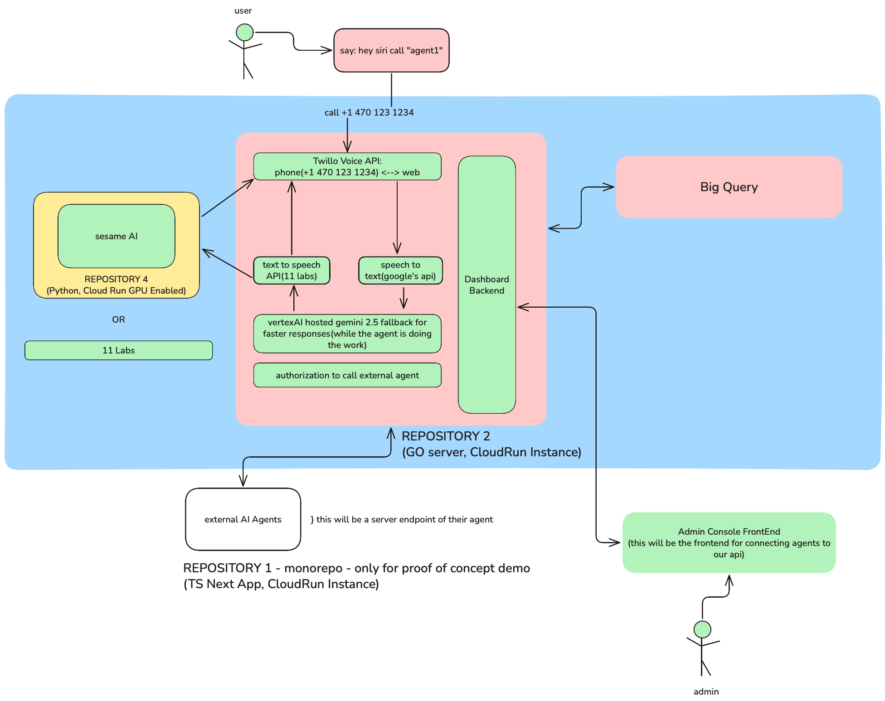

<<<<<<< HEAD
<div align="center">
  
  
  <h1>🎙️ HeyAI Backend</h1>
  
  <p><strong>Talk to AI like you'd call a friend</strong></p>
  
  <p>
    <a href="#features">Features</a> •
    <a href="#demo">Demo</a> •
    <a href="#architecture">Architecture</a> •
    <a href="#setup">Setup</a> •
    <a href="#api">API</a>
  </p>
</div>

---

## 💡 Inspiration

In a world dominated by apps and screens, we asked: **What if AI was as simple as making a phone call?**

HeyAI makes AI accessible to everyone—no apps, no typing, no barriers. Just dial a number, speak naturally, and get instant AI-powered responses. Perfect for seniors, people with disabilities, or anyone who prefers voice over text.

## 🚀 What It Does

HeyAI turns any phone into an AI assistant powered by Google's Gemini 2.5 Flash:

- ** Call & Talk** - Dial our number and start a natural conversation
- ** AI Responses** - Powered by Gemini 2.5 Flash for intelligent answers
- ** Natural Voice** - ElevenLabs TTS for human-like speech
- ** Continuous Conversation** - Ask multiple questions in one call
- ** Universal Access** - Works on any phone, anywhere


## 🏗️ Architecture

```
┌─────────────┐
│   Caller    │
└──────┬──────┘
       │ Dials specific number
       ▼
┌─────────────────────────────────────────────────┐
│              Twilio Voice API                    │
│  ┌──────────┐  ┌──────────┐  ┌──────────┐     │
│  │  /voice  │→ │ Gather   │→ │ /speech- │     │
│  │          │  │ Speech   │  │ result   │     │
│  └──────────┘  └──────────┘  └──────────┘     │
└────────────────────┬────────────────────────────┘
                     │
                     ▼
┌─────────────────────────────────────────────────┐
│           HeyAI Backend (Go)                     │
│  ┌──────────────┐      ┌──────────────┐        │
│  │   Gemini     │  →   │  ElevenLabs  │        │
│  │ 2.5 Flash    │      │     TTS      │        │
│  └──────────────┘      └──────────────┘        │
└────────────────────┬────────────────────────────┘
                     │
                     ▼
              Audio Response
                     │
                     ▼
              Plays to Caller
```

## 🛠️ Tech Stack

- **Backend:** Go 1.25
- **AI Model:** Google Gemini 2.5 Flash (Vertex AI)
- **Voice Synthesis:** ElevenLabs TTS
- **Telephony:** Twilio Voice API
- **Deployment:** Google Cloud Run
- **CI/CD:** GitHub Actions + Cloud Build

## ✨ Features

### Core Functionality
- ✅ Natural language understanding via Gemini
- ✅ High-quality voice synthesis with ElevenLabs
- ✅ Multi-turn conversations
- ✅ Automatic hangup detection
- ✅ Error handling and fallbacks

### Technical Highlights
- ⚡ Low-latency responses (<3s)
- 🔒 Secure environment variable management
- 📊 Structured logging
- 🌐 RESTful API design
- 🐳 Containerized deployment

## 🚀 Setup

### Prerequisites
- Go 1.25+
- Google Cloud account
- Twilio account
- ElevenLabs API key

### Installation

1. **Clone the repository**
```bash
git clone https://github.com/ai-atl-dev/HeyAI-backend.git
cd HeyAI-backend
```

2. **Install dependencies**
```bash
go mod download
```

3. **Set up environment variables**
```bash
cp .env.example .env
```

Edit `.env`:
```env
GCP_PROJECT_ID=your-project-id
GCP_REGION=us-central1
ELEVENLABS_API_KEY=your-elevenlabs-key
ELEVEN_VOICE_ID=your-voice-id
PORT=8080
```

4. **Run locally**
```bash
go run main.go
```

5. **Expose with ngrok (for Twilio webhook)**
```bash
ngrok http 8080
```

6. **Configure Twilio**
- Go to Twilio Console
- Set webhook URL: `https://your-ngrok-url.ngrok.io/voice`

## 📡 API Endpoints

### `POST /voice`
Initial Twilio webhook - starts the conversation

**Response:** TwiML with speech gathering

### `POST /speech-result`
Processes user speech and generates AI response

**Parameters:**
- `SpeechResult` - Transcribed user speech
- `From` - Caller's phone number

**Response:** TwiML with audio playback

### `GET /audio?text=<text>`
Generates and streams TTS audio

**Parameters:**
- `text` - Text to convert to speech

**Response:** MP3 audio stream

## 🎯 Challenges We Faced

1. **Latency Optimization** - Reduced response time from 8s to <3s through:
   - Pre-warming connections
   - Optimized Gemini parameters
   - ElevenLabs turbo model

2. **TwiML Complexity** - Learned Twilio's XML-based response format and webhook flow

3. **Audio Streaming** - Implemented efficient MP3 streaming for seamless playback

4. **Error Handling** - Built robust fallbacks for API failures

## 🏆 Accomplishments

- ✨ Built a fully functional voice AI system in 48 hours
- 🚀 Achieved <3 second response latency
- 🎤 Natural, human-like conversations
- 📱 Works on any phone worldwide
- 🔧 Clean, maintainable codebase

## 📚 What We Learned

- Integrating multiple AI services (Gemini + ElevenLabs)
- Twilio Voice API and TwiML
- Real-time audio processing
- Go backend development
- Cloud deployment best practices

## 🔮 What's Next

- [ ] **Streaming Audio** - Reduce latency to <500ms with WebSocket streams
- [ ] **Multi-Agent Support** - Different AI personalities per phone number
- [ ] **Admin Dashboard** - Web interface for analytics and management
- [ ] **Call Recording** - Save and analyze conversations
- [ ] **BigQuery Integration** - Store call data for insights
- [ ] **Multi-Language Support** - Support 50+ languages
- [ ] **Voice Cloning** - Custom voices for businesses

## 👥 Team

Built with ❤️ by the AI ATL Dev team

## 📄 License

MIT License - see [LICENSE](LICENSE) file

## 🙏 Acknowledgments

- Google Cloud for Vertex AI
- ElevenLabs for amazing TTS
- Twilio for voice infrastructure
- The open-source community

---

<div align="center">
  <p><strong>Made for [Hackathon Name] 2025</strong></p>
  <p>⭐ Star us on GitHub if you like this project!</p>
</div>
=======
# `heyai-backend`
if you can't understand this it's not for you

>>>>>>> 40edebb6a71657f472e1d9bb19040886d4d40df2
